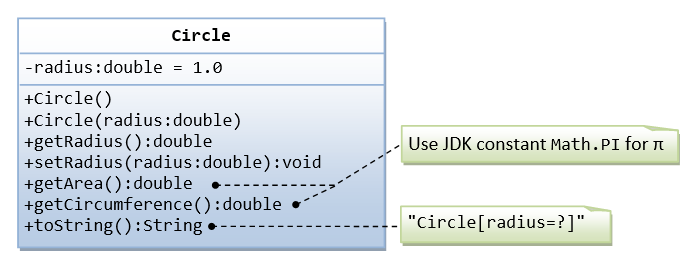

This first exercise shall lead you through all the basic concepts in OOP.

A class called circle is designed as shown in the following class diagram. It contains:

*   Two private instance variables: radius (of the type double) and color (of the type String), with default value of 1.0 and "red", respectively.
*   Two overloaded constructors - a default constructor with no argument, and a constructor which takes a double argument for radius.
*   Two public methods: getRadius() and getArea(), which return the radius and area of this instance, respectively.